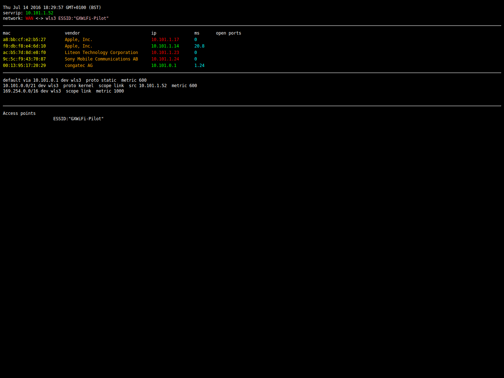

## Network manager written in jQuery and bash (and CGI)
Note: this is not a beginner's guide! Knowledge of Apache, jQuery and bash is
almost certainly necessary.

__watch__ is an HTML front end to a suite of network tools: ping, arp, mac vendor
lookup and port scan. The design comprises a suite of bash CGI scripts and an
HTML front end which is updated with jQuery.



The HTML can be opened from wherever you unpacked it but the contents of cgi-bin
must be served (copied into the appropriate place for your web server). If you
can get this bit working you're in with a fighting chance. 

I'm using it on Scientific Linux 6.5 (cgi-bin in`/var/www/cgi-bin`) and Ubuntu
15/16 (cgi-bin in `/usr/lib/cgi-bin`).

Download `oui.txt` (the list of MACs and vendors) and copy it into your
cgi-bin. See http://standards.ieee.org/regauth/oui/oui.txt

Test your copying by using the scripts directly.
```
http://localhost/cgi-bin/ping?10.10.10.10
```

## Response times
A port scan is only issued when a new node is added. However, if there are many
entries in the ARP table the server may be preoccupied with port scanning lots
of IPs and appear slow to update the ping response column. This will become more
responsive once the port scans have completed.

## Design
The structure is an example of the [Model View
Controller](https://en.wikipedia.org/wiki/Model-view-controller) design
pattern.

## Installing Apache
```
sudo apt-get install apache2
sudo service apache2 start
```

And check it's working in a browser: http://127.0.0.1/

Copy the scripts into your cgi-bin:
```
sudo cp cgi-bin/* /usr/lib/cgi-bin/
```
